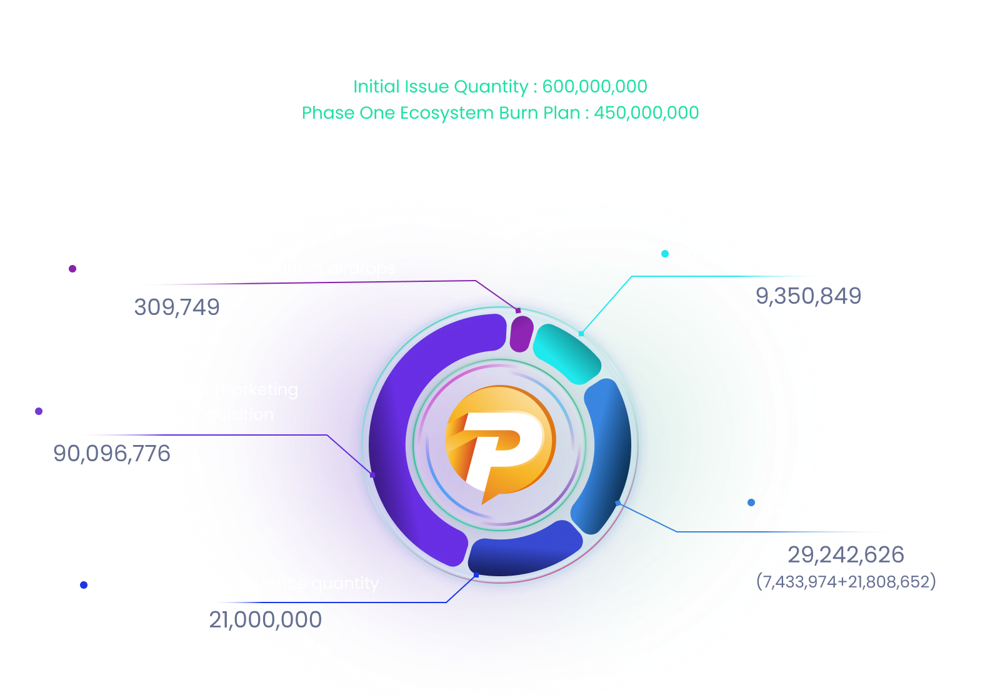

# # Tokenomics

<figure><figcaption></figcaption></figure>

* The page is updated on a weekly basis.
* Daily updates can be found in the N-PIK EX Staking menu at [https://n-pik.com/ex-staking](https://n-pik.com/ex-staking.)


**Update**

* Allocated the open burn allocation according to the policies related to the opening of the N-PIK service, ICO participation rate, and updates to the ecosystem plan.
* The public sale quantity has been removed. After the ICO, PIK Token can only be acquired through airdrops and transactions on N-PIK services.


## <mark style="color:orange;">**1. PIK**</mark>

### 1) PIK Token Supply Plan

* 1st Seed Sale: 25,000,000
* 2nd Presale: 35,000,000
* Institutional: 30,000,000
* Airdrop: 50,000,000
*   Marketing and Ecosystem: 10,000,000

* Total Quantity: 150,000,000
* Total Issuance: 600,000,000
* Open Burn Quantity: 450,000,000

> <mark style="color:yellow;">In the N-PIK coin ecosystem, there are no company-held shares or developer coins related to the company whatsoever. This implies that the company has no resources to influence the market, such as arbitrarily leading the coin price or generating additional profits and increasing circulation by selling holdings during coin value rises, leading to a price drop.</mark>

### 2) Coin Ecosystem Goal

> <mark style="color:yellow;">The total supply of this coin is not issued with the aim of achieving full circulation. Instead, it is intended to maintain a minimum circulation regardless of the total supply, with the remainder being burned, depending on market conditions.</mark>
>
> <mark style="color:yellow;">\*Our ecosystem goal: to maintain minimal circulation for service and actively reduce coin circulation through a burning policy for service.</mark>

The N-PIK platform token “PIK” will be distributed exclusively through various airdrops and ICOs. The service has introduced a token ecosystem to align with the blockchain casino trend, aiming for marketing efficiency, user acquisition, and expansion. The objective is to generate market value based on the N-PIK service's performance. To this end, the N-PIK service plans not to distribute the entire ICO issuance at once but rather based on the achievement of specific marketing goals. This approach includes a focus on achieving a rapid burn rate through various systems, with the expectation that the nature of the N-PIK Token as a dividend token will lead to an increase in its value. The airdrop service will provide game continuity for users, contributing to the N-PIK service's success.

In addition, unsold tokens from each sale phase will be handled according to the needs of the ecosystem at the time, including burning, airdrop allocation, marketing purposes, and company reserves. This strategy aims to quickly respond to market needs and maintain the flexibility of the platform by reflecting updates to the ecosystem graph or relevant sections as needed.

***

## <mark style="color:orange;">**2. Dividend timing**</mark>

### **1)** Distribution Method

Dividends are paid on a monthly basis through the Ex Staking Service in accordance with the Ex Staking Distribution Policy.

### **2)** Dividend Standard

30\~50% of the total revenue (during the event period) is calculated on a monthly basis.

* Total revenue: actual revenue shared with game providers (Evolution, Progmatik, etc.)
* May change from gross revenue phase to tax excluded phase depending on local tax policy changes.

***

## <mark style="color:orange;">**3. Airdrop additional PLYP to ICO participants**</mark>

### **1) ICO Participants = PIK Token + PLYP**

* 1st Pre-Sale (80% discount) 10,000 PIK: 10,000 PIK tokens + 2,500 PLYP = $200 total purchase cost
*   2nd Pre-Sale (50% discount) for 10,000 PIK: 10,000 PIK tokens + 6,250 PLYP = $500 total purchase cost

* PLYP can only be initially airdropped through participation in the ICO, and the PLYP airdrop service may be terminated early regardless of whether the ICO proceeds or not.

\* PLYP tokens will be airdropped through various events after the ICO airdrop.\
\* The utilization of PLYP tokens on the n-pik site may be limited to specific games.

### **2) PLYP**

* Issue Price: $0.080
* Game Play Price: $0.100
* Bankswap Price: $0.12
* Bankswap rate: 10\~30% of monthly service revenue (event)

The above figures are subject to change depending on ecosystem conditions.

### **3)** Dividend Criteria for Company Revenue&#x20;

<figure><figcaption></figcaption></figure>

#### - Royal Partner

A partner such as a streamer, influencer, corporation, or individual business owner who has entered into a separate contract through marketing alliance.

#### - Total Revenue

#### The stage where actual revenue is shared with game providers (Evolution, Programmatic, etc.). It consists of the sum of self-service revenue and 70% of referral revenue.

#### - Service Revenue

The stage excluding coin distribution costs and game provider costs.

#### - Real Revenue

The stage where local casino taxes are charged.

* PIK dividends are paid in USDT and distributed according to the Ex Staking criteria.&#x20;
* Unsold or undistributed tokens may be partially or fully burned depending on ecosystem conditions.
* There are no holdings by the company or developers, only distributions related to ICOs, airdrops, and marketing. There are no foundation-related distributions beyond the designated distribution.
* The revenue share of PIK will remain consistent at 30-50% (during events) for the first year after launch. There is a possibility that this percentage will be adjusted by a certain percentage after the first year. If such adjustments are implemented, the goal will be to fine-tune the ecosystem ratio, promote game airdrops, ensure service stability, and maintain ecosystem balance.

\
\*The ecosystem on this page may be subject to change for the benefit of users.

