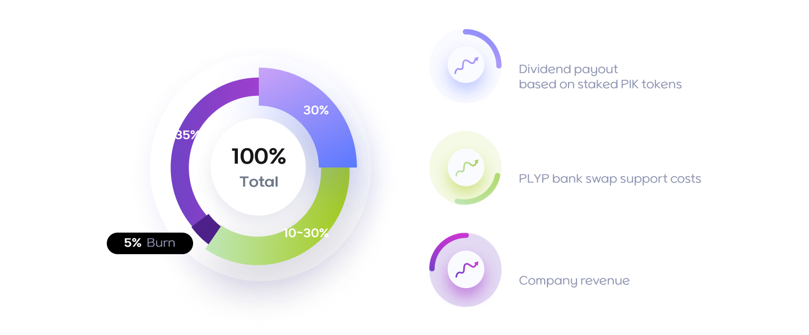

# # Tokenomics

<figure><figcaption></figcaption></figure>

## **1. PIK**

### 1) PIK Token Supply Plan

* 1st Pre-sale: 150 million = $0.02 /Sale period: before service opening
* 2nd Pre-sale: 150 million = $0.05 /Sale period: After the opening of the test beta service.
* 1st \~ 10th Public sale: 20 million tokens each sale = $0.10 /Sale period: 1 month after service launch N-PIK game participation event: 100 million airdrops = $0.10 (If due to policy reasons, the additional sale of PIK TOKEN through ICO will not be proceeded according to ecosystem environment at that time, so the airdrop will be terminated and the entire token amount will be burned, or some specific amount of tokens subject to burning will be supplied as airdrop).

> <mark style="color:yellow;">In the N-PIK coin ecosystem, there are no company-held shares or developer coins related to the company whatsoever. This implies that the company has no resources to influence the market, such as arbitrarily leading the coin price or generating additional profits and increasing circulation by selling holdings during coin value rises, leading to a price drop.</mark>

### 2) Coin Ecosystem Goal

> <mark style="color:yellow;">The total supply of this coin is not issued with the aim of achieving full circulation. Instead, it is intended to maintain a minimum circulation regardless of the total supply, with the remainder being burned, depending on market conditions.</mark>
>
> <mark style="color:yellow;">\*Our ecosystem goal: to maintain minimal circulation for service and actively reduce coin circulation through a burning policy for service.</mark>

The N-PIK platform token “PIK” will be distributed exclusively through various airdrops and ICOs. The service has introduced a token ecosystem to align with the blockchain casino trend, aiming for marketing efficiency, user acquisition, and expansion. The objective is to generate market value based on the N-PIK service's performance. To this end, the N-PIK service plans not to distribute the entire ICO issuance at once but rather based on the achievement of specific marketing goals. This approach includes a focus on achieving a rapid burn rate through various systems, with the expectation that the nature of the N-PIK Token as a dividend token will lead to an increase in its value. The airdrop service will provide game continuity for users, contributing to the N-PIK service's success.

Additionally, unsold tokens from each sale phase will be handled according to the ecosystem's needs at that time, including burning, allocation for airdrops, marketing purposes, and company reserves. The distribution of the company's reserved tokens will be limited to a maximum of 20% of the company's monthly sales revenue, based on the public sale price. This strategy aims to swiftly respond to market demands and maintain the flexibility of our platform, with updates to be reflected in the ecosystem graph or related sections as necessary.

## **2. Dividend timing**

### **1) Dividend standard**

Only those included through the staking service will be distributed on a daily basis in proportion to their PIK token holding percentage.

### **2) Dividend timing**

* Dividends: Upon the official launch of the service and immediate revenue generation, dividends will be distributed based on the staked quantity.

## **3. Airdrop additional PLYP to ICO participants**

### **1) ICO Participants = PIK Token + PLYP**

* &#x20;1st Pre-sale (80% discount): 10,000 PIK Token + 2,500 PLYP = Total purchase cost $200
* 2nd Pre-sale (50% discount): 10,000 PIK Tokens + 6,250 PLYP = $500 total purchase cost
* Public sale (same for all rounds): 10,000 PIK Tokens + 12,500 PLYP = Total purchase cost $1,000 (PLYP is calculated and paid at the issue price of $0.08).
* PLYP can only be initially airdropped through ICO participation, and the PLYP airdrop service may be terminated early regardless of the ICO's continuation.
* The utilization of PLYP tokens on the n-pik site may be limited to specific games.

### **2) PLYP**

* Issue Price: $0.080
* Game Play Price: $0.100
* Bankswap price: $0.12

\*The issuance figures above are subject to change depending on ecosystem conditions.

### **3) Dividends and burn basis on company revenue**&#x20;

<figure><figcaption></figcaption></figure>

Gross revenue base excludes government-related taxes and expenses related to gaming partners \
(e.g. Pragmatic Play).&#x20;

30%: Dividend payout based on staked PIK tokens (policy to be announced).&#x20;

10-30%: PLYP Bank Swap support cost. (To be executed until all distributed PLYP are repaid and recorded as company revenue) / The ratio of Bank Swap may vary depending on the ecosystem situation.

5%: Burn&#x20;

35%: Company revenue

* PIK dividends are paid in USDT and distributed according to staking criteria.
* Tokens unsold or undistributed depending on ecosystem conditions may be partially or entirely burned.
* There are no company holdings or developer holdings, only distribution related to ICOs, airdrops, and marketing. There are no foundation-related distributions outside of those specified.
*   The profit distribution rate for PIK will be consistently maintained at 30% during the first year after the service launch. Beyond the initial year, there is a possibility that this rate could be adjusted to 20% or lower. Such adjustments, if implemented, would be aimed at fine-tuning the burn percentage, facilitating game airdrops, ensuring service stability, and preserving the balance of the ecosystem.

    \

\*The ecosystem of this page may be subject to change for user profit.

