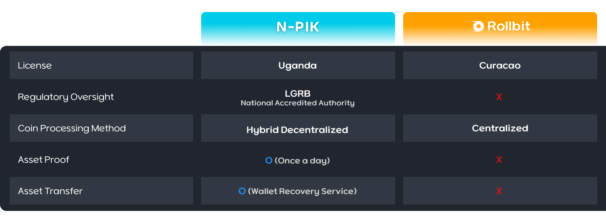

# # Why PIK token?

The token protocol of existing online casinos is centralized, making it difficult to transparently prove users' asset ownership. Additionally, when normal service provision becomes challenging due to various risks, the centralized approach makes it difficult to properly recover users' assets. To address these issues, we have implemented a hybrid decentralized approach called the S2K L2 (Split Security Key Layer2) system.

The S2K L2 system checks the user's cryptocurrency holdings within the wallet daily. In case of issues with the casino service, such as server downtime, users can recover their wallets through the 'WALLET RECOVERY' service using the security key provided at the time of registration. This ensures that users can securely retrieve their deposited cryptocurrencies at any time, regardless of service availability. Even if the casino server experiences downtime.
We aim to provide users with transparency and security by addressing the risks associated with centralized exchanges like FTX, differentiating our service from others in the market. Through this initiative, we aspire to create new opportunities in a market expected to see significant growth and establish a notable presence in the global fiat (token) based casino market.

* Coin Ecosystem Goal \
  The PIK token, designed as a cornerstone of the N-PIK service, aims to reflect market value based on our service's performance. Distributed through ICOs and various airdrops, the PIK token focuses on rapid burn rates and dividend potential, promising increased value. The Play PIK Token (PLYP), an integral part of our ecosystem, serves as a reward token, enhancing user engagement and providing early ICO participants with significant financial incentives.
* Security: The N-PIK service securely preserves user assets through the Wallet recovery feature of the S2K L2 system. Wallet recovery is a service that decrypts the encrypted private key of the wallet provided by N-PIK, allowing users to migrate their wallet to an external (personal) wallet.
* Transparency: The user's crypto assets sent to the casino are synchronized daily and verified in the user's personally owned N-PIK dividend wallet, making the operation much more transparent than any centralized exchange or online casino service.
* Fairness: The N-PIK service is operated with fairness and ongoing management of games under the oversight of the Ugandan government agency 'LGRB (Lotteries and Gaming Regulatory Board Uganda).'
* Revenue Scalability (A): PLYP will be initially airdropped only through participation in the ICO, and the PLYP airdrop service may be terminated early regardless of the continued existence of the ICO.
*   Revenue Scalability (B): N-PIK applies the service revenue generated from Kenya Casino Galaxy's N-BIX, operated by the same affiliate, to the PIK token ecosystem, providing additional revenue scalability to PIK token holders. (Income criteria for service providers, excluding various fees, betting taxes, and taxes by country and company.)

    ※ N-BIX: Kenya casino license services and blockchain services will proceed after approval. Prior to approval, services for Kenya Shilling and coin swap functionality will be carried out through API-based partnerships with cryptocurrency exchanges.\
    \* The ecosystem partnership of PIK Token may be terminated early depending on the circumstances of the partner company. This contract will be maintained for 6 months after the N-BIX service opens.
*   Ghost Pick Point: Ghost Pick point is event point which is only airdropped through game play (centralized DB). The entire airdrop amount received by users is burned once a month.

    The points are airdropped on the 1st day of every month and are completely incinerated on the last day of each month.

    From the 1st day of the month, users can collect airdrop points to participate in various ETH and USDT acquisition events on a first-come, first-served basis or enter drawings to win prizes.

    Also, users can make additional profits by swapping Ghost Pick points with Ghost Pick Tokens on the swap page and then trade them on USDT market of N-PIK Trade.

    The buying force will be the force that secures the necessary quantity during first-come-first-served events or draws, and can experience an additional Token ecosystem by providing a portion of net sales to the Ghost Pick event.

    Ghost Pick points will provide game continuity to game-playing users, contributing to the increase in revenue for the N-PIK service.
* Token issuance and burning: PIK tokens are distributed solely through the ICO. Additionally, if the company's revenue exceeds a specific threshold (to be disclosed later) during the staged sale through the ICO, all remaining unsold tokens will be burned and the sale will be stopped. Furthermore, 5% of the company's revenue will be continuously burned every day. The purpose of issuing and operating the PIK token is to allow users who participated in the ICO to realize a rapid return as the company grows.
* Wager and Blockchain Launchpad: N-PIK aims to leverage blockchain to successfully launch Wager games and casino games, with the goal of expanding into various mobile Wager games and blockchain game launchpad services. Beyond the blockchain-based betting and casino market, our long-term objective is to use Wager and blockchain to diversify game market expansion, ultimately creating high corporate value.
* Services based on a Lotteries and Gaming Regulatory Board Uganda (LGRB) license.

<figure><figcaption></figcaption></figure>
